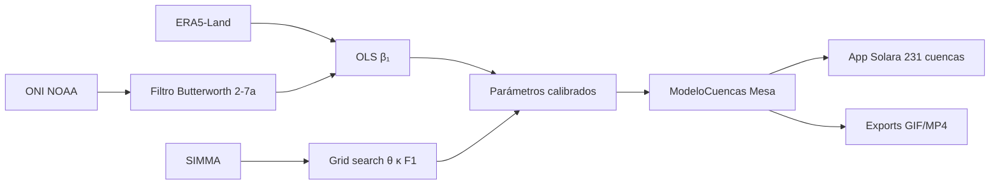

# ABM-ENSO-Colombia · Documentación

!!! abstract "TL;DR"
    Modelo basado en agentes donde cada cuenca hidrográfica de Colombia responde al forzamiento ENSO. Calibrado contra 6826 eventos SIMMA (1981–2024) con F1 = 0.629 global, r = 0.43 en validación 2010–2012.

## Visión general

El Modelo 1 de la arquitectura ABM-UTADEO captura la dinámica hídrica de **231 cuencas HydroBASINS** bajo forzamiento ENSO. Cada cuenca es un agente con tres variables de estado:

- $H_i(t)$ — humedad acumulada (mm)
- $P_i(t)$ — precipitación mensual (mm)
- $E_i(t)$ — evento binario (0/1), activo si $H_i(t) > \theta \cdot C_i$

Las ecuaciones de transición son:

$$
P_i(t) = P_{0,i}(\text{mes}) + \beta_{1,i} \cdot \text{ONI}(t) + \varepsilon
$$

$$
H_i(t+1) = (1 - \kappa) \cdot H_i(t) + P_i(t+1)
$$

$$
E_i(t) = \mathbb{1}\{H_i(t) > \theta \cdot C_i\}
$$

donde $C_i$ es la capacidad hídrica (mm), $\theta \in [0,1]$ el umbral relativo, $\kappa \in [0,1]$ la tasa de drenaje mensual, y $\varepsilon \sim \mathcal{N}(0, \sigma_P^2)$ el ruido estocástico.

## Resultados calibrados

| Parámetro | Valor | Método |
|-----------|------:|--------|
| $\beta_1$ (nacional) | −7.33 mm/mes/°C | OLS ONI × ERA5, lag 1 |
| $\theta^*$ | 0.700 | Grid search F1 vs SIMMA |
| $\kappa^*$ | 0.275 | Grid search F1 vs SIMMA |
| F1 (calibración) | 0.629 | 6826 eventos 1981–2024 |
| r (validación) | 0.43 | vs SIMMA 2010–2012 |
| F1 (validación) | 0.74 | vs SIMMA 2010–2012 |

### β₁ por área hidrográfica

| Área | β₁ (mm/mes/°C) |
|------|---------------:|
| Magdalena-Cauca | −9.5 |
| Caribe | −8.2 |
| Pacífico | −5.8 |
| Orinoco | −4.5 |
| Amazonas | −2.0 |

## Arquitectura

## Navegación

- [Instalación](instalacion.md) · entorno conda, cuenta Copernicus, cuencas
- [Quickstart](quickstart.md) · pipeline completo en 3 comandos
- [Teoría](teoria/fundamentos.md) · marco conceptual ENSO/Lorenz/ABM
    - [Fundamentos](teoria/fundamentos.md)
    - [ENSO-Lorenz](teoria/enso-lorenz.md)
    - [Descripción ODD](teoria/odd.md)
- [Módulos](modulos/data.md) · referencia técnica por subpaquete
    - [data](modulos/data.md) · clientes de datos
    - [analysis](modulos/analysis.md) · filtros, Lorenz, calibración
    - [model](modulos/model.md) · ABM en Mesa
    - [viz](modulos/viz.md) · app Solara
- [Roadmap](roadmap.md) · fases 1–6 y estado
- [Referencias](referencias.md) · bibliografía
