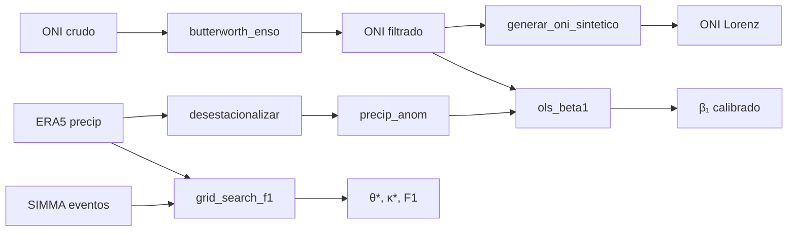

# Módulo `analysis`

Filtros espectrales, oscilador de Lorenz y calibración estadística de parámetros.

## Flujo de calibración



## `filtros`

### Butterworth pasa-banda ENSO

Filtro Butterworth orden 4 con `filtfilt` (fase cero). Banda 2–7 años separa la señal ENSO del ruido estacional y tendencias de largo plazo.

$$
H(\omega) = \frac{1}{\sqrt{1 + (\omega/\omega_c)^{2n}}}
$$

```python
from abm_enso.analysis.filtros import butterworth_enso
oni_filtrado = butterworth_enso(oni_crudo)
```

### Desestacionalización

Resta la climatología mensual (promedio por mes calendario) para producir anomalías.

## `lorenz`

Sistema clásico de Lorenz (1963):

$$
\begin{aligned}
\dot{x} &= \sigma (y - x) \\
\dot{y} &= x (\rho - z) - y \\
\dot{z} &= xy - \beta z
\end{aligned}
$$

con $\sigma=10$, $\rho=28$, $\beta=8/3$. La variable $x(t)$ normalizada a la media y std del ONI filtrado produce una serie sintética estadísticamente coherente pero infinitamente larga.

**Resultado de calibración actual:** r(Lorenz, ONI_filtrado) = 0.042 — el atractor de Lorenz no "imita" al ENSO observado en fase, sino que **sustituye** un forzamiento estocástico con uno caótico determinista. Sirve para proyecciones de sensibilidad pero no para hindcasting punto a punto.

## `calibracion_beta`

OLS simple: $\text{precip\_anom} \sim \alpha + \beta_1 \cdot \text{ONI} + \varepsilon$.

**Resultado actual (nacional):**

$$
\beta_1 = -7.33 \text{ mm/mes por °C ONI}, \quad r^2 = 0.176
$$

El $r^2$ bajo (0.176) se debe a promediar Colombia entera, mezclando regiones con respuestas opuestas. Para calibrar por región usar `calibrar_por_grupo()`.

## `calibracion_theta_kappa`

Grid search bidimensional sobre $\theta \in [0.60, 0.95]$ y $\kappa \in [0.05, 0.45]$ maximizando F1 contra eventos SIMMA mensuales (umbral: >5 eventos/mes).

**Resultado actual:**

$$
\theta^* = 0.700, \quad \kappa^* = 0.275, \quad F_1 = 0.629
$$

## `metricas`

- `pearson_r(a, b)` → correlación lineal [−1, 1]
- `rmse(a, b)` → raíz del error cuadrático medio
- `f1_score(y_true, y_pred)` → F1 para clasificación binaria
- `lomb_scargle(serie, f_max)` → periodograma espectral (tolera NaN)

## API

::: abm_enso.analysis
    options:
      show_root_heading: false
      show_source: false
